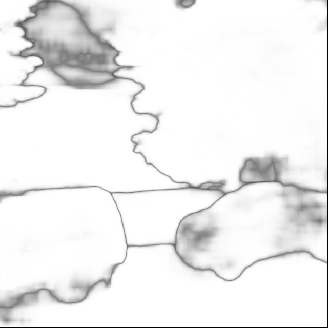
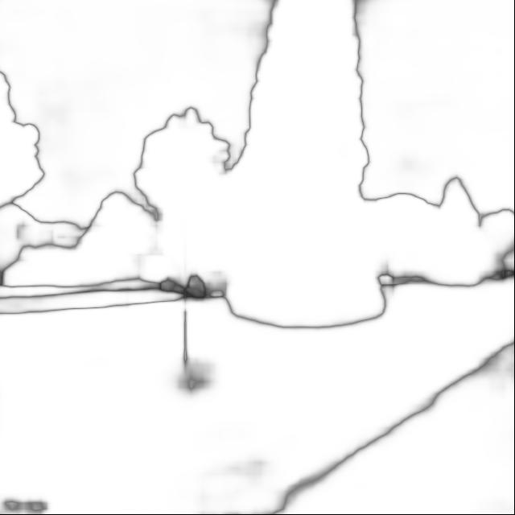
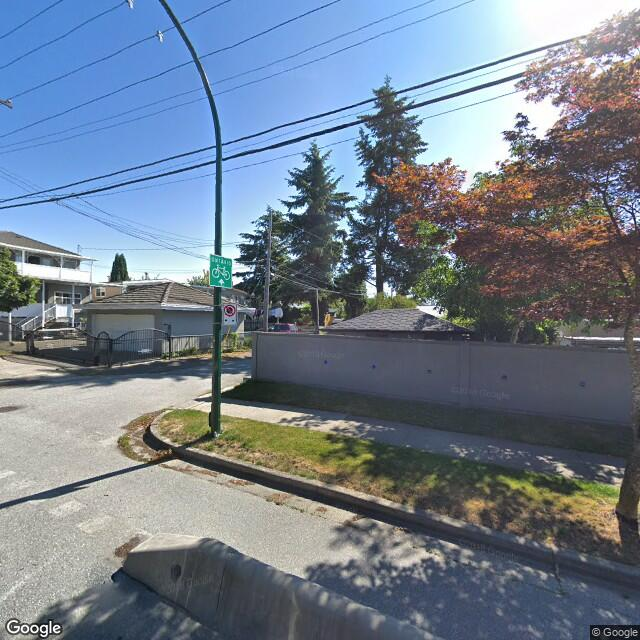
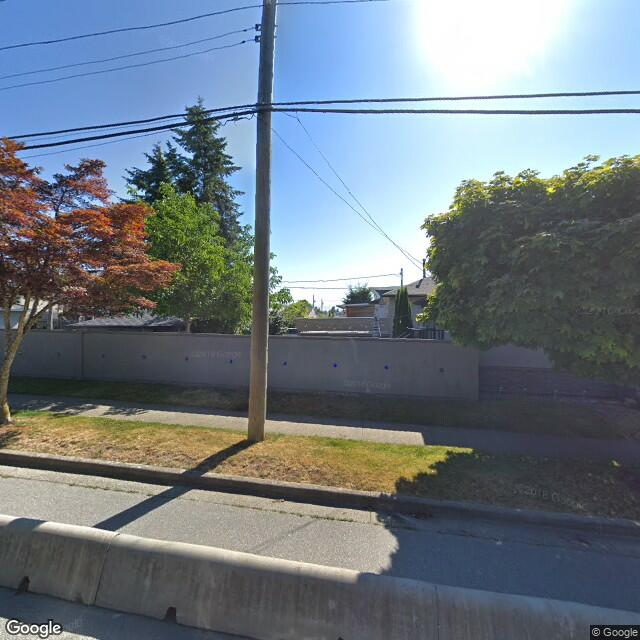

# Keras implementation of [PSPNet(caffe)](https://github.com/hszhao/PSPNet)

Implemented Architecture of Pyramid Scene Parsing Network in Keras.

For the best compability please use Python3.5
### Setup
1. Install dependencies:
    * Tensorflow (-gpu)
    * Keras
    * numpy
    * scipy
    * pycaffe(PSPNet)(optional for converting the weights) 
    ```bash
    pip install -r requirements.txt --upgrade
    ```
2. Converted trained weights are needed to run the network.
Weights(in ```.h5 .json``` format) have to be downloaded and placed into directory ``` weights/keras ```


Already converted weights can be downloaded here:

 * [pspnet50_ade20k.h5](https://www.dropbox.com/s/0uxn14y26jcui4v/pspnet50_ade20k.h5?dl=1)
[pspnet50_ade20k.json](https://www.dropbox.com/s/v41lvku2lx7lh6m/pspnet50_ade20k.json?dl=1)
 * [pspnet101_cityscapes.h5](https://www.dropbox.com/s/c17g94n946tpalb/pspnet101_cityscapes.h5?dl=1)
[pspnet101_cityscapes.json](https://www.dropbox.com/s/fswowe8e3o14tdm/pspnet101_cityscapes.json?dl=1)
 * [pspnet101_voc2012.h5](https://www.dropbox.com/s/uvqj2cjo4b9c5wg/pspnet101_voc2012.h5?dl=1)
[pspnet101_voc2012.json](https://www.dropbox.com/s/rr5taqu19f5fuzy/pspnet101_voc2012.json?dl=1)

## Convert weights by yourself(optional)
(Note: this is **not** required if you use .h5/.json weights)

Running this needs the compiled original PSPNet caffe code and pycaffe.

```bash
python weight_converter.py <path to .prototxt> <path to .caffemodel>
```

## Usage:

```bash
python pspnet.py -m <model> -i <input_image>  -o <output_path>
python pspnet.py -m pspnet101_cityscapes -i example_images/cityscapes.png -o example_results/cityscapes.jpg
python pspnet.py -m pspnet101_voc2012 -i example_images/pascal_voc.jpg -o example_results/pascal_voc.jpg
```
List of arguments:
```bash
 -m --model        - which model to use: 'pspnet50_ade20k', 'pspnet101_cityscapes', 'pspnet101_voc2012'
    --id           - (int) GPU Device id. Default 0
 -s --sliding      - Use sliding window
 -f --flip         - Additional prediction of flipped image
 -ms --multi_scale - Predict on multiscale images
```
## Keras results:














## Implementation details
* The interpolation layer is implemented as custom layer "Interp"
* Forward step takes about ~1 sec on single image
* Memory usage can be optimized with:
    ```python
    config = tf.ConfigProto()
    config.gpu_options.per_process_gpu_memory_fraction = 0.3 
    sess = tf.Session(config=config)
    ```
* ```ndimage.zoom``` can take a long time


# Classes:
##     colormap = np.zeros((256, 3), dtype=np.uint8)
##     colormap[0] = [128, 64, 128] # road
##     colormap[1] = [244, 35, 232] # sidewalk
##     colormap[2] = [70, 70, 70] # building
##     colormap[3] = [102, 102, 156] # wall
##     colormap[4] = [190, 153, 153] # fence
##     colormap[5] = [153, 153, 153] # pole
##     colormap[6] = [250, 170, 30] # traffic light
##     colormap[7] = [220, 220, 0] # traffic sign
##     colormap[8] = [107, 142, 35] # vegetation
##     colormap[9] = [152, 251, 152] # terrain
##     colormap[10] = [70, 130, 180] # sky
##     colormap[11] = [220, 20, 60] # person
##     colormap[12] = [255, 0, 0] # rider
##     colormap[13] = [0, 0, 142] # car
##     colormap[14] = [0, 0, 70] # truck
##     colormap[15] = [0, 60, 100] # bus
##     colormap[16] = [0, 80, 100] # train
##     colormap[17] = [0, 0, 230] # motorcycle
##     colormap[18] = [119, 11, 32] # bicycle
#

